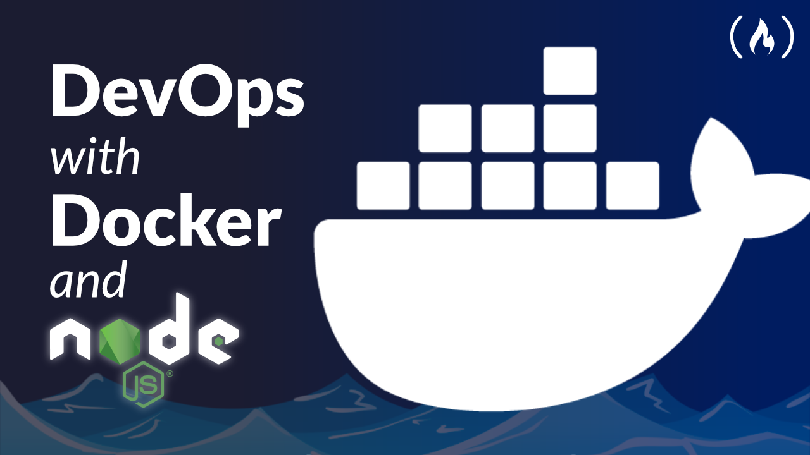

<h1 align="center">Bem vindo ao Node-App 👋</h1>

 

<p align="center">
  
  <a href="Test" target="_blank">
    
  </a>
  <a href="" target="_blank">
    
  </a>
 
</p>

# Sobre

> Este é um simples projeto em node no Docker que foi colocado na cloud. Este App foi desenvolvido pela freecodecamp, você pode acessar o site da video aula [aqui](https://www.freecodecamp.org/news/learn-docker-by-building-a-node-express-app/).

## Instalação

```sh
Em desenvolvimento
```

## Como Usar

```sh
Em desenvolvimento
```
## Tecnologias

Neste repositório você irá encontrar as seguintes tecnologias sendo utilizadas.
- JavaScript
- Node
- Express
- Mongo
- Docker
- AWS or any cloud company

## Ferramentas
Para este projeto foi utilizado estas ferramentas:
- Visual Studio code
- Insomnia

## Autor
👤 **Alberto Junior**


* Github: [Alberto Júnior](https://github.com/wayfiding)
* LinkedIn: [Alberto Souza](https://linkedin.com/in/alberto-souza)